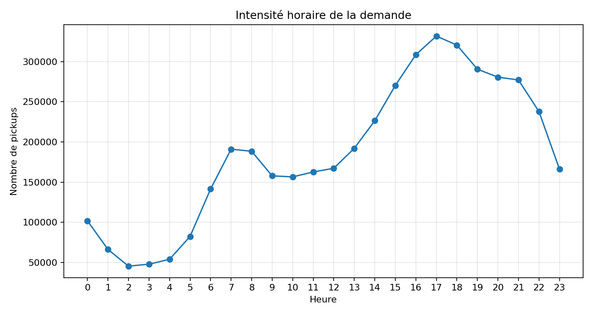
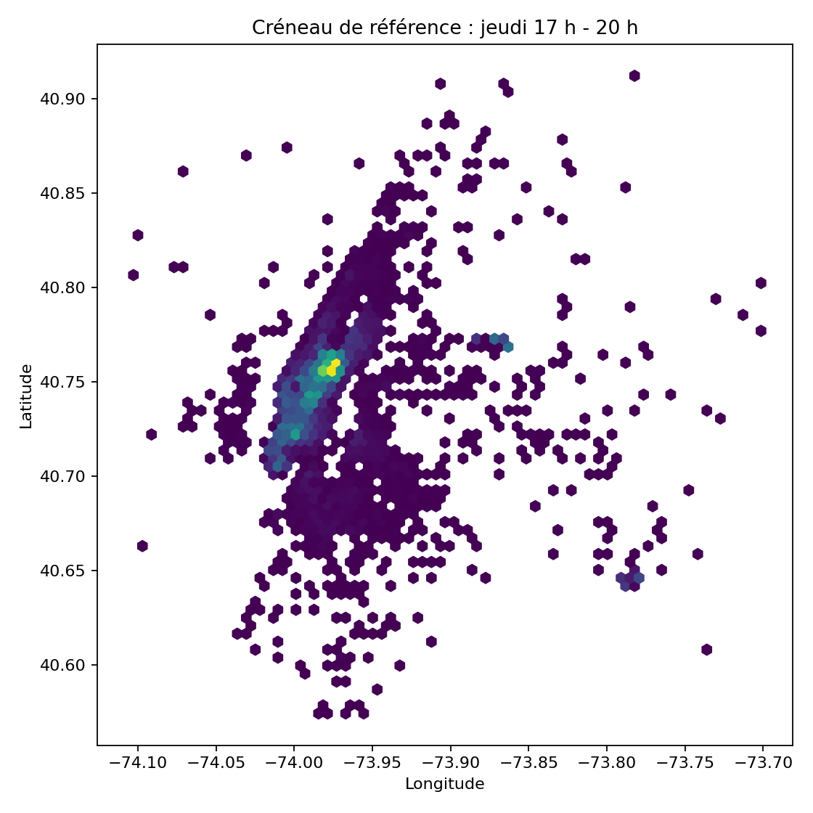

# Uber Pickups — Hot Zones à New York

Clustering géospatial non supervisé pour identifier les zones de forte demande Uber et aider au positionnement des chauffeurs.

---

## Problème métier

Les chauffeurs Uber ne sont pas toujours positionnés là où se trouve la demande. Au-delà de **7 minutes d'attente**, les utilisateurs annulent leur course.

> **Question** : où les chauffeurs devraient-ils se positionner selon le jour et l'heure ?

---

## Résultats

| Métrique | Valeur |
|---|---|
| Pickups analysés | 4 464 452 (après filtre géographique NYC) |
| Période couverte | Avril – Septembre 2014 |
| Meilleur k (KMeans) | 5 clusters |
| Silhouette KMeans | 0.496 |
| Silhouette DBSCAN (hors bruit) | 0.545 |
| Taux de bruit DBSCAN | ~67 % |

**Zones chaudes identifiées** : Manhattan (cœur de demande), Brooklyn, Queens, axes de transit.  
**Créneau le plus structurant** : jeudi–vendredi, 17h–20h.

---

## Visualisations

<p align="center">
  
  
</p>

<p align="center">
  
  
</p>

---

## Couverture du cahier des charges

| Exigence | Statut |
|---|---|
| Carte des hot zones (Plotly) | ✅ |
| Hot zones par jour de semaine | ✅ — 7 jours |
| Comparaison KMeans + DBSCAN | ✅ — tuning + métriques + cartes |

---

## Structure du projet

```
Bloc_3 Uber Pickups/
├── README.md
├── requirements.txt
├── Bloc3_Uber_Presentation.pptx
├── assets/
│   ├── pickups_par_jour.png
│   ├── pickups_par_heure.png
│   ├── reference_jeudi_17_20.png
│   └── centres_hot_zones_par_jour.png
├── data/
│   └── uber-trip-data.zip          ← non versionné
└── notebooks/
    ├── uber_hotzones_clean.ipynb   ← version propre, relançable
    └── uber_hotzones_executed.ipynb ← version avec outputs
```

---

## Installation

```bash
pip install -r requirements.txt
```

## Exécution

```bash
jupyter lab
```

Ouvrir `notebooks/uber_hotzones_clean.ipynb` et placer `uber-trip-data.zip` dans `data/`.

---

## Stack technique

Python · pandas · numpy · scikit-learn · plotly · jupyter

